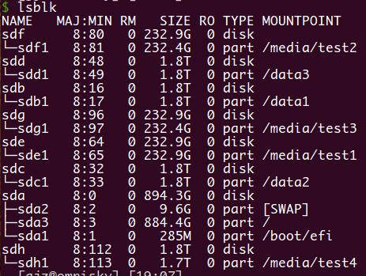

## raid 挂载问题
`/proc/mdstat` 在这查看 raid 的信息。

插上硬盘后，ubuntu 系统可能默认挂载为 raid 格式，具体挂载路径可以如下查看
```
$ cat /proc/mdstat
Personalities : [linear] [multipath] [raid0] [raid1] [raid6] [raid5] [raid4] [raid10]
unused devices: <none>
```

这种是被取消 raid 挂载之后的。

raid 可能是以 md 为前缀，可以用 `mdadm` 命令：
> mdadm - manage MD devices aka Linux Software RAID。

依次 stop 掉就行。**也许** 就能取消掉 raid 信息了，然后就正常挂载即可。
```
mdadm --stop /dev/mdx
```

这是挂载的具体信息。


---
参考链接：

[1] https://serverfault.com/questions/383362/mount-unknown-filesystem-type-linux-raid-member

[2] http://www.ephestione.it/fix-mount-unknown-filesystem-type-isw_raid_member/

[3] http://www.geekpills.com/operating-system/linux/remove-raid-linux
